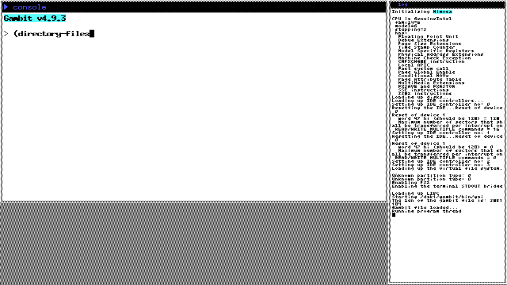

<h1 style="float:right; display:inline-block">Mimosa</h1>

<div style="clear:both"></div>



# Introduction

The Mimosa operating system consists of a minimal kernel built on C++ and Scheme. It contains a Scheme implementation of a hard drive (ATA) driver, keyboard (PS2), serial (8250 UART), FAT32 filesystem and a small real time clock manager. The project was built to experiment with developement of operating system using a high level functional language to study the developement process and the use of Scheme to build a fairly complex system.

# Organisation

The projet is divided in folders:

- `scheme` contains the Scheme sources for the drivers, utilitary functions and the `gambini.scm` file that loads up the Gambit system
- `archive-items` contains files folders that are placed into the built archive
- `attic` contains deprected files kept for comparison or quick-access
- `drivers` contains C++ drivers
- `fonts` contains the system fonts
- `include` contains header files
- `libc` contain an implementation of the C standard library provided to the Gambit runtime
- `res` contains external ressources (like images included to this repo)
- `utils` contain small tools built to aid developement
- The root folder contains various kernel files and build system files.

# Required tooling

Currently, Mimosa builds with GCC 9.2.1. You will need the 32 bit tools in order to build the system (`g++-multilib`) as well as GNU make. Right now, the system only builds on Linux. If you want to run the OS on an emulator, the makefile provides support for `qemu`, in particular `qemu-system-i386`.

# Quick-install and run instructions

Assuming you have the correct compiler setup, the following steps will
build and run mimosa:
    
```Shell
    make clean
    make single-archive # creates a booting archive in floppy.img
    make run  # requires qemu
```

Multiple debugging `make` commands are also available:
- `make debug` waits for GDB connection on port :1234
- `make run-with-serial` passes through a serial port from the VM to the host on port 44555. It can be used in conjonction with the `telnet` or `netcat` utility to control a REPL from your host system.

The createimg.sh script is used to create a FAT32 image that can be mounted and add necessary Scheme driver files to the archive. However, the folder `archive-items` will be entirely replicated on the image and so you can add other files to be accessible at boot.

# Dependencies

The kernel requires a compatible Gambit runtime. Currently, the modified Gambit runtime is located [here](https://github.com/SamuelYvon/gambit).
